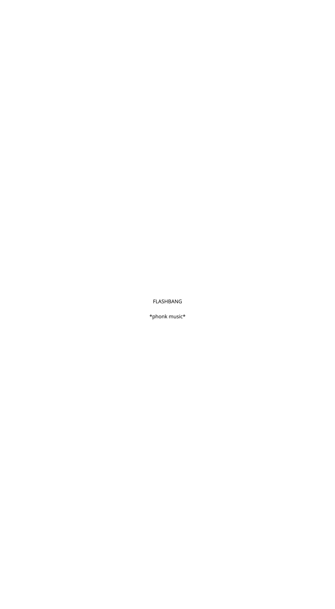

      ’                     ‚       '                                   
    ’             ¦˜¨¯¨˜¦ ¦˜¨¯¨˜¦°        '                            
¦˜¨¯¯¨˜˜¨¯¯¨˜¦°¦\___\/      ¦”  ¦˜¨¯¨˜¦\˜¨¯¨˜\‘‘’’/˜¨¯¨˜/\˜¨¯¨˜\ 
¦\__/    \__'/¦’¦˜¨¯¨˜¦/      /¦‚  ¦:.   ;¦/___/¦ '¦:.    ¦/___'/'¦ 
¦'¦¯ '\__'/`)/¦ ¦ ¦\______/ /‚‚  ¦___'¦¯`)/ '¦'¦ '¦\___'\¯)/¯¦ ¦ 
'\¦__¦`)/'¦__'¦/°¦ ¦¯`)/¯ ¯¦ /°   ¦¯)/¯¦___;¦/‘‚'¦ ¦¯)/¯'¦__„¦ / 
     '¦__¦‘’   ‚  '\¦_____'¦/’’    ¦___¦    ‚      \¦___'¦ ’ º   ’ 
    ’                               ___   
              ’                    ¦___¦”‚‚
 /˜¨¯¨˜/¦˜¨¯¨˜¦ ‚ ¦˜¨¯¨˜¦˜¨¯¨˜¦º¦\˜¨¯¨˜\‚ 
 ¦˜¨¯¨˜'¦\˜¨¯¨˜\° ¦:.          '¦  \¦:.   '¦º
 ¦___;¦/___/¦  ¦___ ¦___¦º /___/¦º
 ¦¯\(¯¦¯`)/¯¦ ¦‚ ¦¯)/¯¦¦¯)/¯¦  ¦¯`)/'¦;¦‚
 ¦___¦____¦/° ¦___'¦¦___¦  ¦___¦/‚‚
              '          ’                    ' /˜¨¯¨˜/¦      ’                        '       ___           ' /˜¨¯¨˜/¦
       '                       ‚              '/     '/ /             ’     '                  ¦___¦”‚‚        '/     '/ /
' /˜¨¯¨˜(¦„¨¯¯°¦    ¦˜¨¯¨˜\¦˜¨¯¨˜¦       ' ¦:.    ¦/   ¦˜¨¯¨˜¦/˜¯¯¨˜\°‚/˜¨¯¨˜/\˜¨¯¨˜\  ¦\˜¨¯¨˜\‚       ' ¦:.    ¦/  
/˜¨¯¯¨˜/¦:.    '¦    ¦:.   ¦\      '¦ /˜¨¯¨˜/¦:.    ¦ ‚  ¦      /\___'/¦‚‚¦:.    ¦ '¦:.    ¦  \¦:.   '¦º/˜¨¯¨˜/¦:.    ¦ ‚ 
¦\____\¦___;¦    ¦___¦ ¦___'¦‚¦\___\¦____\º ¦___'¦ ¦¯)/¯¦'¦º¦\___\/___'/¦  /___/¦º¦\___\¦____\º
¦ ¦¯`)/¯¦¦¯ ¯¯¦    ¦¯)/¯¦ ¦¯`)/'¦ ¦'¦¯)/¯¦¦¯`)/¯'¦º ¦¯`)/;¦\¦___¦/‚ ¦'¦¯` ¯¦¦¯`)/'¦ ¦‚ ¦¯`)/'¦;¦‚¦'¦¯)/¯¦¦¯`)/¯'¦º
'\¦____¦¦___‚¦    ¦___'¦ ¦___¦‚\¦___¦¦____'¦º ¦___'¦ ‚     ’   \¦___'¦¦___¦/‚‚ ¦___¦/‚‚\¦___¦¦____'¦º
    ’                                        ’                           
              ’   ¦˜¨¯¯¨˜\          ’     ’                             
 /˜¨¯¨˜/¦˜¨¯¨˜¦ ‚¦:.     ¦\\/˜¨¯¯¨˜¦°¦˜¨¯¯¨˜˜¨¯¯¨˜¦° ¦˜¨¯¨˜¦˜¨¯¨˜¦º
 ¦˜¨¯¨˜'¦\˜¨¯¨˜\°¦:.     ¦ \/¦:.     ¦ ¦\__/    \__'/¦’ ¦:.          '¦ 
 ¦___;¦/___/¦ ¦____¦\'¦/¦____¦’¦'¦¯ '\__'/`)/¦ ¦  ¦___ ¦___¦º
 ¦¯\(¯¦¯`)/¯¦ ¦‚¦¯`)/¯'¦:. ¦¯\(¯¯¦‚'\¦__¦`)/'¦__'¦/° ¦¯)/¯¦¦¯)/¯¦ 
 ¦___¦____¦/°¦____¦:. ¦____¦      '¦__¦‘’   ‚   ¦___'¦¦___¦ 
  ___           ' /˜¨¯¨˜/¦            '‚   
 ¦___¦”‚‚        '/     '/ /    °           
¦\˜¨¯¨˜\‚       ' ¦:.    ¦/  ¦˜°¯¨˜¦/˜¨¯¨˜/ 
 \¦:.   '¦º/˜¨¯¨˜/¦:.    ¦ ‚ ¦:.    ¦\˜¨¯¨˜\ 
 /___/¦º¦\___\¦____\º¦___;¦'¦___'¦‚
 ¦¯`)/'¦;¦‚¦'¦¯)/¯¦¦¯`)/¯'¦º¦¯`)/¯¦'¦¯)/¯¦‚
 ¦___¦/‚‚\¦___¦¦____'¦º¦___;'¦¦___'¦‚

<!-- <h1 align="center">
    
</h1> -->

<!--
**DillerOFire/DillerOFire** is a ✨ _special_ ✨ repository because its `README.md` (this file) appears on your GitHub profile.

Here are some ideas to get you started:

- 🔭 I’m currently working on ...
- 🌱 I’m currently learning ...
- 👯 I’m looking to collaborate on ...
- 🤔 I’m looking for help with ...
- 💬 Ask me about ...
- 📫 How to reach me: ...
- 😄 Pronouns: ...
- ⚡ Fun fact: ...
-->
